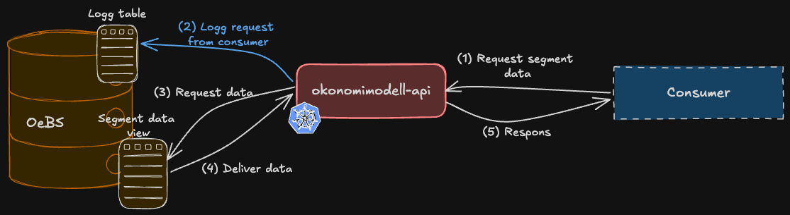

# Okonomimodell API 

Tjenesten eksponerer et API for å hente data segmenter fra økonomimodellen i OeBS-databasen,
og fungerer dermed som et integrasjonslag mellom OeBS og andre tjenester som trenger tilgang til konteringsinfo fra OeBS. 
Formålet er at API-et skal være generelt slik at det kan benyttes av flere tjenester.

  
  

## Architecture

## Funksjonalitet
Segmentdataen som er eksponert i API-et kommer fra viewet `XXRTV_GL_KONTERINGSINFO_V` i OeBS-databasen,
dataen hentes fra en kolonne i viewet som heter `json_payload`.
Deretter mappes den over til et Java-objekt i tjenesten, som igjen blir eksponert ut i JSON-format i API-et.
Formålet er å eksponere dataen i samme format som det ligger i viewet i OeBS, men samtidig bruke skjemaen definert i 
openApi spesifikasjonen slik at dokumentasjon blir automatisk generert i swagger. Det er derfor ingen logikk i tjenesten som endrer dataen.

I tillegg benyttes tabellen `xxrtv.xxrtv_okonomimodell_api_logg` til å lagre logger i oebs hver gang det gjøres requester av en bruker mot api-et.
Formålet med disse loggene er å gi oebs utviklere tilgang til logger uten å måtte gå inn i applikasjonsloggene, og dermed kunne feilsøke problemer knyttet til kall mot oebs direkte fra oebs. 
Det logges informasjon om tidspunkt for kall, hvilken endpoint som ble kalt, og respons på kallet.

## Avhengigheter
Tjenesten er avhengig av tilkobling mot oebs, både for å hente data og for å logge kall i databasen.
Det er ulike instanser som kjører mot ulike oebs miljøer. Tjenesten kjører mot u1 lokalt, mot t1 og q1 i dev-gcp, og mot prod i prod.
Det er ingen andre eksterne avhengigheter.

## Hvordan kjøre lokalt
Tjenesten kan kjøres lokalt dersom utvikleren som kjører har lese og skrivetilgang til OeBS-u1,
og har satt følgende environment variabler:
- `OEBS_USERNAME` - brukernavn for oebs
- `OEBS_PASSWORD` - passord for oebs
- `OEBS_URL` - url for oebs

Samtidig må det være mulig å koble seg opp til oebs, som ligger i sikker sone, fra der koden kjøres. 
Her kan utvikler enten bruke **vdi-utvikler-oebs** som er opprettet for å gjøre utvikling direkte i sikker sone, eller bruke **Global Secure Access Client**.
Det kan være lurt å enable **Global Secure Access Client** før man kobler til naisdevice, fordi begge deler er VPN-løsninger som kan gå i bena på hverandre.

## Testing
Det er satt opp enhetstester med JUnit og Mockito, men det er ikke satt opp noen integrasjonstester.

## Alarmering og Overvåkning
Det er ikke satt opp noen alarmering eller overvåkning av tjenesten. Driftsproblemer må derfor fanges opp av brukere som opplever feil ved kall mot API-et,
og det er ingen automatiske alarmer som fanger opp feil i tjenesten.

## Deployment 
Alle kodeendringer skal gjøres ved å opprette en pull request, og det er ikke tillatt å pushe direkte til main branch.
Det er foreløpig ingen navnestandard på brancher, men det anbefales å inkludere Jira-sakenummeret i branchnavnet,
for eksempel `JIRA-123/add-tests`. Committer skal inkludere beskrivende ord og saken det gjelder. 

Det viktigste er imidlertid at commiten som tilhører en Jira-sak skal referere til denne, 
og at navnet på pull requesten skal referere til Jira-saken. For eksempel, hvis du jobber med Jira-saken `OEBS-123`,
bør commit-meldingen din inkludere `feat(OEBS-123): new rest endpoint` og pull requesten bør ha en tittel som er tilsvarende.
Alle merge commits squashes inn i main, så tittelen bør reflektere de viktigste endringene.
Dette gjør at historikken kan kobles direkte til hvilke Jira-saker saken omhandler.

## Dokumentasjon
- [Swagger t1](https://okonomimodell-api-t1.intern.dev.nav.no/api/v1/swagger-ui.html)
- [Swagger q1](https://okonomimodell-api-q1.intern.dev.nav.no/api/v1/swagger-ui.html)
- [Swagger prod](https://okonomimodell-api.intern.nav.no/api/v1/swagger-ui.html)

- [SonarCloud](https://sonarcloud.io/project/overview?id=navikt_okonomimodell-api)
