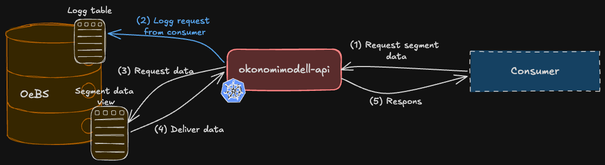

# Okonomimodell API 

Tjenesten eksponerer et API for å hente data segmenter fra økonomimodellen i OeBS-databasen,
og fungerer dermed som et integrasjonslag mellom OeBS og andre tjenester som trenger tilgang til konteringsinfo fra OeBS. 
Formålet er at API-et skal være generelt slik at det kan benyttes av flere tjenester.

  
  

## Architecture

## Funksjonalitet
Segmentdataen som er eksponert i API-et kommer fra viewet `XXRTV_GL_KONTERINGSINFO_V` i OeBS-databasen,
dataen hentes fra en kolonne i viewet som heter `json_payload`.
Deretter mappes den over til et Java-objekt i tjenesten, som igjen blir eksponert ut i JSON-format i API-et.
Formålet er å eksponere dataen i samme format som det ligger i viewet i OeBS, men samtidig bruke skjemaen definert i 
openApi spesifikasjonen slik at dokumentasjon blir automatisk generert i swagger. Det er derfor ingen logikk i tjenesten som endrer dataen.

Ved validering av kontostreng kalles prosedyren `apps.xxrtv_gl_val_kontostreng_pkg.validerkstreng`, som returnerer en json
med ccid og validateMessage. Dersom ccid er satt i responsen fra oebs ansees kontostrengen som gyldig,
dersom ccid ikke er satt ansees kontostrengen som ugyldig og validateMessage vil inneholde en feilmelding.

I tillegg benyttes tabellen `xxrtv.xxrtv_okonomimodell_api_logg` til å lagre logger i oebs hver gang det gjøres requester av en bruker mot api-et.
Formålet med disse loggene er å gi oebs utviklere tilgang til logger uten å måtte gå inn i applikasjonsloggene, og dermed kunne feilsøke problemer knyttet til kall mot oebs direkte fra oebs. 
Det logges informasjon om tidspunkt for kall, hvilken endpoint som ble kalt, og respons på kallet.

## Avhengigheter
Tjenesten er avhengig av tilkobling mot oebs, både for å hente data og for å logge kall i databasen.
Det er ulike instanser som kjører mot ulike oebs miljøer. Tjenesten kjører mot u1 lokalt, mot t1 og q1 i dev-gcp, og mot prod i prod.
Det er ingen andre eksterne avhengigheter.

## Hvordan kjøre lokalt
Tjenesten kan kjøres lokalt dersom utvikleren som kjører har tilgang til oebs, se [oksty-docs](https://navikt.github.io/oksty-documentation/docs/team-oebs/oebs-access#accessing-oebs-locally)
for info om hvordan få tilgang. I tillegg må følgende env variabler settes: 
- `OEBS_DB_USERNAME` - brukernavn for oebs, hentes fra secret [okonomimodell-apo-t1](https://console.nav.cloud.nais.io/team/team-oebs/dev-gcp/secret/okonomimodell-api-t1)
eller [okonomimodell-api-u1](https://console.nav.cloud.nais.io/team/team-oebs/dev-gcp/secret/okonomimodell-api-u1) 
- `OEBS_DB_PASSWORD` - passord for oebs, hentes fra samme secret som brukerenavn
- `ORACLE_URL` - url for oebs, hentes fra secret [okonomimodell-api-t1-oracle](https://console.nav.cloud.nais.io/team/team-oebs/dev-gcp/secret/okonomimodell-api-t1-oracle)
hvor t1 endres til u1 hvis du skal mot u1 
- `AZURE_APP_CLIENT_ID` - id
- `AZURE_APP_WELL_KNOWN_URL` - hentes fra environment variablen med samme navn fra applikasjonen [okonomimodell-api-t1](https://console.nav.cloud.nais.io/team/team-oebs/dev-gcp/app/okonomimodell-api-t1/instancegroup/okonomimodell-api-t1-64b6f56b7c)

### Teste lokalt 
For å teste validering av kontostreng-endepunktet er det to mulige scenarioer som skal testes med følgende parametere:
- Invalid kontostreng: Testes ved å benytte default parametere i swagger
- Valid kontostreng: Testes ved å sende inn følgende inputparametere til `/kontostreng/validering`:

| Inputparameter (endpoint) | Verdi        |
|---|--------------|
| system | VIERI        |
| artskonto | 645000000000 |
| kostnadssted | 522400       |
| produkt | AB0001       |
| oppgave | 000000       |
| felles | 000000       |
| statskonto | 060501000000 |
| kilde | 000008       |
| tilsagnsar | 000000       |
| frittfelt1 | 000000       |
| frittfelt2 | 000000       |
| fullmaktskode | Z1           |
| regnskapsforer | 80           |

## Testing
Det er satt opp enhetstester med JUnit og Mockito, men det er ikke satt opp noen integrasjonstester.

## Alarmering
Det er satt opp [alarmer for tjenesten i Nais med prefix OkonomimodellApi](https://console.nav.cloud.nais.io/team/team-oebs/alerts?filter=OkonomimodellApi). 

## Overvåkning
Det er satt opp standard overvåkning av applikasjonene gjennom grafana dashboards:
- [Grafana dashbboard for t1](https://grafana.nav.cloud.nais.io/a/nais-apm-app/services/team-oebs/okonomimodell-api-t1?namespace=team-oebs&environment=dev) 
- [Grafana dashbboard for q1](https://grafana.nav.cloud.nais.io/a/nais-apm-app/services/team-oebs/okonomimodell-api-q1?namespace=team-oebs&environment=dev)
- [Grafana dashbboard for prod](https://grafana.nav.cloud.nais.io/a/nais-apm-app/services/team-oebs/okonomimodell-api?namespace=team-oebs&environment=prod)

## Deployment 
Alle kodeendringer skal gjøres ved å opprette en pull request, og det er ikke tillatt å pushe direkte til main branch.
Det er foreløpig ingen navnestandard på brancher, men det anbefales å inkludere Jira-sakenummeret i branchnavnet,
for eksempel `JIRA-123/add-tests`. Committer skal inkludere beskrivende ord og saken det gjelder. 

Det viktigste er imidlertid at commiten som tilhører en Jira-sak skal referere til denne, 
og at navnet på pull requesten skal referere til Jira-saken. For eksempel, hvis du jobber med Jira-saken `OEBS-123`,
bør commit-meldingen din inkludere `feat(OEBS-123): new rest endpoint` og pull requesten bør ha en tittel som er tilsvarende.
Alle merge commits squashes inn i main, så tittelen bør reflektere de viktigste endringene.
Dette gjør at historikken kan kobles direkte til hvilke Jira-saker saken omhandler.

## Dokumentasjon
- [Swagger t1](https://okonomimodell-api-t1.ekstern.dev.nav.no/api/v1/swagger-ui.html)
- [Swagger q1](https://okonomimodell-api-q1.ekstern.dev.nav.no/api/v1/swagger-ui.html)
- [Swagger prod](https://okonomimodell-api.nav.no/api/v1/swagger-ui.html)

- [SonarCloud](https://sonarcloud.io/project/overview?id=navikt_okonomimodell-api)
